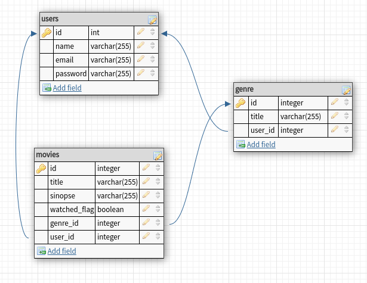

# Save Movie

Projeto realizado durante realização de um curso a cerca do AnonisJS na Udemy.

## Escopo

Disponibilizar um serviço pelo qual o usuário poderá cadastrar filmes que deseja assistir com as seguites informações (título*, gênero, sinopse*)

## Funcionalidades

O **usuário** poderá criar seu cadastro, e estando logado poderá inserir, editar seus dados(exceto email), visualizar e excluir filmes ou gêneros criados por ele.

Uma ves que o filme esteja cadastrado o usuário poderá marcar o filme como assistido ou para assistir.

## Entidades


## Modelagem Banco de dados



### Migrations

Run the following command to run startup migrations.

```js
adonis migration:run
```

```bash
yarn install
```

or manually clone the repo and then run `npm install`
